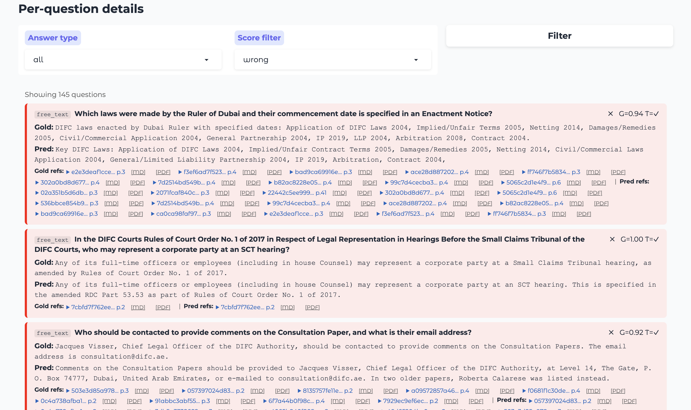

# Юридическое поле экспериментов для RAG

*Agentic RAG Legal Challenge, март 2026*

**Иван Комаров, Евгений Чуканов**

MORAG: [github.com/catonmoon/morag](https://github.com/catonmoon/morag) · Eval: [manzherok.ru/eval](https://manzherok.ru/eval/)

---

## We love RAG!

Нам нравится тема RAG (retrieval augmented generation). Почему? Потому что без RAG никуда. А как показало соревнование, о котором я расскажу ниже, заменить его вообще нечем.

RAG — это когда есть свои документы и надо чтобы система их выучила. Самое простое (и оказывается лучшее) — просто найти нужные части или документы и подать их в промпт вместе с вопросом для формулировки ответа ЛЛМ. Т.е. когда вам нужен ответ "Как включить стиралку?", система просто открывает инструкцию на нужном месте и переформулирует технический на "нажми эту кнопку".

Когда вы начинаете делать такую систему для вашей компании, вы также осознаёте важность **ссылок** на место, откуда система взяла кусок текста — а что если машина открыла инструкцию не на "включить", а "прочистить стиралку"? Хорошо бы глянуть прямо на сырой документ. Ведь вы спрашиваете систему, потому что вы **не знаете** ответ, соответственно вы по умолчанию **верите** системе. Если она ошибается — значит надо проверять. К этому, кстати, нас приучили поисковики — они по умолчанию просто дают ссылки, а не ответ.^[1]^

Что же у нас появилось нового по сравнению с веком Интернета? В интернете при поиске важна скорость, поэтому документы должны быть проиндексированы, а ссылки выдаваться по индексу быстро. Именно оттуда пришла современная реализация BM25 — по сути поиск по ключевым словам, усиленный TF-IDF и другими трюками. BM25 ищет слова. Но главная новинка RAG-эпохи — это **семантический поиск** (embeddings): когда система ищет не слова, а смысл. Именно их сочетание и даёт современный RAG.

Ещё один важный аспект — скорость. Хотя, как мы видим с рассуждающими моделями, человек может и подождать, если нужен хороший и правильный ответ.

Насколько хорошо просто использовать BM25? Ответ даёт наш первый эксперимент. Но сначала — подготовим поле для экспериментов.

---

^[1]^ 92% пользователей интернета используют его для получения повседневной информации (Pew Internet Survey, 2004; Manning et al., *Introduction to Information Retrieval*).

---

## Соревнование как бенч для RAG

С 15 по 22 марта проходило соревнование Agentic RAG Legal Challenge. Оно было хорошо организовано, дают призы — и мы вместе с моим коллегой, другом и разработчиком Евгением Чукановым решили проверить нашу корпоративную систему, которую мы развиваем и про которую уже [рассказывали](https://vkvideo.ru/video-164555658_456241706?t=37m44s). Наша система называется MORAG — RAG Машинного Отделения, дирекции компании Koronatech. Ядро MORAG мы развиваем как open-source проект вместе с системой оценки RAG — [RAG Leaderboard](https://github.com/catonmoon/rag-leaderboard).

### Как устроено соревнование

ARLC — это задача поиска ответов на вопросы по корпусу юридических документов. Документы реальные: судебные решения, законы, регуляторные акты Дубайского международного финансового центра (DIFC). Не синтетика, не Википедия — настоящие PDF с таблицами, сносками и формулировками в духе "в соответствии с пунктом 4(b)(ii) статьи 17".

Соревнование шло в два этапа:

- **Warm-up** — 30 документов, 100 вопросов, 15 попыток сабмита. Можно экспериментировать.
- **Final** — ~300 документов, 900 вопросов, **2 попытки**. Цена ошибки — половина шансов.

Вопросы бывают шести типов: `boolean` (да/нет), `date` (дата), `name` (название/номер дела), `names` (список), `number` (число) и `free_text` (свободный ответ до 280 символов). Первые пять — детерминированные: либо точно, либо нет. Для `number` дают допуск ±1%, для `names` — Jaccard similarity. Для остальных — exact match после нормализации.

### Как считается скор

Формула выглядит так:

```
Total = (0.7 × S_det + 0.3 × S_asst) × G × T × F
```

- **S_det** — точность детерминированных ответов (boolean, date, name, names, number)
- **S_asst** — качество свободных ответов (free_text), оценивает LLM-судья по 5 критериям
- **G** — grounding: насколько страницы, которые вы процитировали, совпадают с правильными
- **T** — телеметрия: корректно ли заполнены метаданные ответа (токены, timing)
- **F** — скорость: бонус если TTFT^[2]^ < 1 секунды (+5%), штраф если > 3 секунд

Посмотрите на формулу внимательно. G, T и F стоят **не в сумме, а в произведении**. Это значит, что G — не просто один из показателей, это **множитель на весь скор**. Плохой retrieval — и никакой умный LLM вас не спасёт. Именно это мы и обнаружили на собственном опыте.

---

^[2]^ Time To First Token.

---


---

## Хроника экспов^[3]^

Warm-up давал 15 попыток — мы использовали их все. Вот что получилось:

| # | Дата | Описание | S_det | S_asst | G | Total |
|---|------|----------|-------|--------|---|-------|
| v3 | 15 мар | gpt-5_4-2026-03-05, все 30 документов загружены на платформу | 0.843 | 0.667 | 0.451 | 0.362 |
| v4 | 16 мар | MORAG v1 (Qwen 3.5-9b локально) | 0.671 | 0.693 | 0.552 | 0.374 |
| v5 | 16 мар | Qwen 3.5-flash 1M CAG, 350K токенов в промпт | 0.971 | 0.553 | 0.563 | 0.403 |
| v6 | 17 мар | BM25 top-12 страниц | 0.943 | 0.540 | 0.390 | **0.269** |
| v7 | 17 мар | BM25 + semantic + RRF | 0.871 | 0.567 | 0.717 | 0.468 |
| v8 | 17 мар | grok-4-1-fast-non-reasoning + hybrid retrieval | 0.886 | 0.573 | 0.752 | 0.543 |
| v10 | 17 мар | MORAG v2 (Grok via OpenRouter) | 0.986 | 0.693 | 0.718 | 0.626 |
| v11 | 17 мар | MORAG v3 | **1.000** | 0.680 | 0.757 | 0.664 |
| v12 | 17 мар | reasoning on/off по типу вопроса + pinning maps + 6000-chunking | 0.971 | 0.660 | 0.896 | 0.749 |
| v13 | 18 мар | MORAG v6 | 0.971 | 0.720 | 0.829 | 0.719 |
| v14 | 18 мар | Grok + фикс Q15 | 0.986 | 0.680 | 0.889 | 0.761 |
| v15 | 18 мар | Финальная полировка free_text | 0.986 | 0.733 | **0.901** | **0.780** |

---

^[3]^ Экспериментов.

---

На таблицу стоит смотреть не по строкам, а по столбцам. **S_det** почти не менялся с v5 — модели и так умеют отвечать на вопросы. Зато **G** вырос с 0.45 до 0.90, и именно он утащил Total с 0.36 до 0.78. Это и есть главный урок.

Разберём по шагам что происходило.

### v3: OpenAI — просто загрузим документы

OpenAI на маленьких документах, когда просто подгружаешь их в админке — просто прелесть! Давайте не будем мудрствовать лукаво, а просто так и сделаем. Тем более что провайдеры предоставляют RAG из коробки (мы уже тестировали RAG от Grok и были приятно удивлены, что наш RAG лучше — "Как тебе такое, Илон Маск?").

Результат в таблице: Total=0.362. Значит, придётся что-то делать.

### v4: Делаем MORAG

Запускаем MORAG — лучше, чем OpenAI, но в целом слабо. Продолжаем искать.

### v5: А зачем RAG, если есть CAG?

Дима Колодезев (один из капитанов [Капитанского Мостика](https://m.vkvideo.ru/playlist/-164555658_94)) говорил: зачем RAG, ведь есть CAG^[4]^, а дальше будет вообще сплошной CAG. Действительно — пусть модель своим трансформером ищет сама. Попробуем последнюю от Алибабы, закрытую Qwen 3.5-Flash с контекстом 1М. 350К токенов за раз (и она не кэширует, в отличие от Gemini 3.1 Pro — жалко, но дёшево и так). Лучше!

^[4]^ CAG (Cache Augmented Generation) — вместо поиска нужных кусков вся база документов загружается в контекст модели целиком.

### v6: А теперь только BM25

Помните, говорил про BM25? Давайте его померим отдельно. Упали до невиданных низин — Total=0.269, антирекорд. Вот где Интернет был до LLM.

### v7: Классика RAG

Делаем классику. Эмбеддинги — мы взяли `text-embedding-3-large`. Почему не самый топовый с [MTEB](https://huggingface.co/spaces/mteb/leaderboard)? Потому что другие тяжёлые, долго считались. Делаем быстро, просто применяем эмбеддинг. (Правильно — как в v12, но до этого ещё дойдём.) И сразу прыгаем: G с 0.39 до 0.72 за один шаг.

### v8: Меняем модель

Переходим на Grok — но пока только `grok-4-1-fast-non-reasoning` для всех типов вопросов. Retrieval тот же гибрид. G продолжает расти до 0.75, Total=0.543. Хорошо, но чувствуем что потолок близко.

### v10–v11: Женя удивляет

Пока мы возились с retrieval, Евгений обновил MORAG до v2 и v3 — и в v11 получил S_det=**1.000**. Все детерминированные вопросы правильно. Как?! Смотрим — у него Grok через OpenRouter, и промпт чуть другой. Берём на заметку.

### v12: Главный инсайт

Вот где всё сложилось. Три изменения сразу:

Первое — **reasoning on/off по типу вопроса**. Оказалось, что `grok-4-1-fast-non-reasoning` плохо справляется с `boolean`, `name` и `names` — теряет 8–16% accuracy. Для этих типов нужна reasoning-модель. Для `date`, `number` и `free_text` — non-reasoning быстрее и не хуже. Разделили.

Второе — **pinning maps**. Юридические документы структурированы предсказуемо: реквизиты закона всегда на странице 1, номер дела — в шапке. Сделали детерминированные правила: если в вопросе упоминается закон — всегда берём страницу 1 этого документа, не спрашивая эмбеддинги. Retrieval не ошибается там, где структура известна заранее.

Третье — **чанкинг 6000 символов**. Вы знаете, что надо читать то, что пишут создатели эмбеддеров? Мало того, что часто есть инструкции для эмбеддеров, которые повышают качество (вы ориентируете эмбеддер на конкретное задание), но и — самое главное — эмбеддер может не съесть весь ваш текст.

В нашем случае мы использовали `text-embedding-3-large` от OpenAI — модель универсальная (инструкции не нужны), но принимает максимум 8191 токенов на вход. Если текст длиннее — он просто обрежется, и эмбеддинг будет только для начала текста. Поэтому важно нарезать текст на чанки подходящего размера.

Но есть второй нюанс: когда мы нашли семантически близкий чанк — мы не отдаём его в контекст. Мы отдаём целую страницу, которой он принадлежит. В юридических документах важен контекст: часть без соседних параграфов может быть понята неправильно. Ищем по чанкам, отвечаем по страницам.

Результат: G=0.896, Total=0.749. Самый большой скачок за всё соревнование.

Но есть нюанс. Наша система работает с большим контекстом — до 15 страниц на вопрос, плюс reasoning-модель думает дольше. Это сказалось на скорости: TTFT вырос, и множитель F опустился до 0.955 вместо максимальных 1.05. Небольшая плата за качество retrieval — мы сочли её приемлемой.

### v13–v14: Полируем

Евгений выпускает MORAG v6 — Total=0.719. Хорошо, но v12 всё равно впереди.

Находим конкретный вопрос, который тянет скор вниз: Q15. Система выдавала SCT 295/2025 вместо SCT 169/2025 — retrieval подтягивал не тот документ. Добавили явный фикс. Total=0.761.

### v15: Финиш warm-up

Последний сабмит warm-up. Дополировали генерацию `free_text`: если ответ длиннее 280 символов — сжимаем итеративно через LLM, не обрезаем грубо. Все 100 вопросов получили ответ. **Total=0.780** — лучший результат warm-up, 45-е место в общем зачёте.

Warm-up закончился. Через три дня — финал с 300 документами и 900 вопросами. И только 2 попытки.

---

## Финальная фаза

### PDF → Markdown

300 документов — это уже не 30. И среди них оказались сканы: не текстовые PDF, а отсканированные страницы. Обычный парсер их просто не видит.

Для нормальных PDF мы использовали `pymupdf4llm` — быстрая конвертация в Markdown с сохранением структуры (заголовки, таблицы, нумерация страниц). Для сканов запустили медленный путь через `Qwen 3.5-9b` как OCR — дольше, но читает то, что текстовый парсер не возьмёт. На выходе у каждой страницы — маркер `<!-- page:N -->`, по которому потом работает retrieval (подсмотрели у Жени).

### Gold set и система валидации

Прогнали пайплайн на 900 вопросах. Получили 844 ответа, 56 null — модель не нашла информацию. Как понять, где мы правы, а где ошибаемся, не тратя 2 из 2 финальных попыток вслепую?

Как настоящие апологеты машинного обучения — без валидации никуда — мы решили построить собственную систему валидации. Написали три проверки — структурная проверка типа, проверка правдоподобия через Grok, и вопрос по соответствию ответа документам. Итог: gold / uncertain / wrong.

900 вопросов, стоимость прогона — **$0.21**.

И написали (ну ладно, это Клод под чутким руководством) систему оценки и проверки:


*Результаты прогона — видно всё: метрики, точность по типам вопросов, где падаем. boolean держится на 99%, free_text тянет вниз — 62.6%.*


*Для каждой ошибки — сразу gold-ответ, наш ответ, ссылки на страницы документов. Видно где мы нашли не то — G=0.94, G=1.00, G=0.92. Хорошо для разметчика!*

Результаты валидации и проверок — в нашем открытом eval-приложении: [github.com/catonmoon/legal-rag-lb](https://github.com/catonmoon/legal-rag-lb), а попробовать можно здесь [manzherok.ru/eval](https://manzherok.ru/eval).

А насколько система сработала - читайте в продолжении от Жени.

---

## MORAGостроение со скоростью ARLC (Евгений Чуканов)

> *Ниже — рассказ Евгения от первого лица. Оригинал: [github.com/catonmoon/morag](https://github.com/catonmoon/morag/blob/main/rag_competition/morag_story.md)*


Такое сообщение пришло мне от шефа, ранним утром в субботу 14 марта.
Последние 12 месяцев мы с Ваней только и делали, что строили РАГи — чанки, эмбеддеры, реранкеры, конференции. Наше окружение уже привыкло к слову "рагостроение". Несколько месяцев назад мы уже обкатали систему на собственной Confluence-документации, где мы совершенствовали пайплайн за счет вручную выверенных вопросов. А тут — международное соревнование! **Надо регистрироваться!**

Может главного приза мы не выиграем, но зато устроим отличный бенчмарк. Команда — по имени проекта: **Morag**. Слоган: _Need more RAG? Use Morag!_

На следующий день регистрация принята, доступ к данным получен.

Команда будет называться по имени проекта — Morag! У нас даже есть клёвый слоган: *Need more RAG? Use Morag!*

### Пайплайн индексации: готовим чанки

Документы нужно нарезать на **чанки** — кусочки, по которым будет делаться поиск. Большинство популярных решений (LightRAG, GraphRAG, Open WebUI) не заморачиваются: _"режем по N символов с перекрытием, нейронки разберутся!"_

Нейронка, конечно, разберётся. Но будет выглядеть примерно так:


Если резать по символам — можно разрезать слово пополам и получить новый смысл. Это **я как дата анал**|итик могу утверждать точно.

Идеальный чанк — **законченная мысль** из документа. Можно поручить это большой LLM, но на соревновании это слишком долго и дорого. Поэтому мы использовали семантический чанкинг, который на тестах давал хорошие результаты.

### Сила контекста

Если разделить документ на чанки — тут же потеряем их связь.


Любая из этих картинок совершенно непонятна без двух остальных. Поэтому для каждого чанка берём весь документ и просим LLM описать контекст вокруг чанка и его роль на странице.

**Как выглядит идеальный чанк:**
- `text` — законченная мысль или факт из документа
- `path` — название документа
- `context` — описание окружения чанка

Каждый чанк не превышает 512 токенов — чтобы эмбеддер [FRIDA](https://huggingface.co/ai-forever/FRIDA) смог корректно его векторизовать. Для поиска по ключевым словам — [sparse-модель GTE](https://huggingface.co/Alibaba-NLP/gte-multilingual-base). База — Qdrant.

### Пайплайн ответов

Для каждого вопроса три стадии:
- **Intent** — LLM формулирует несколько вариантов поисковых запросов
- **Select** — ищем по FRIDA и GTE, RRF, LLM-реранкер выбирает релевантные чанки
- **Answer** — отфильтрованные чанки уходят в LLM для ответа с указанием страниц


А соревнование выступит отличным бенчмарком!

### Warmup: битва за каждую десятую

30 PDF, 100 вопросов, 15 попыток. Первый прогон на `qwen3.5-9b` — треть ответов мимо, Grounding стыдный. Маленький Qwen хорош для обобщения, но не тянет точные ответы. Особенно на multi-document вопросах — модель просто не находила оба документа и отвечала null.

Единственное утешение: встроенные RAG от Grok и OpenAI дали ещё хуже. Стоит отметить — туда были отправлены оригинальные PDF, а не markdown.

**Переход на Grok** стал переломным. OpenAI дал Tier 1 с лимитом 30K токенов в минуту — один запрос select с 30 чанками уже 30K. Плюнули, перешли на Grok: никаких TPM-лимитов, 2M контекст, reasoning из коробки. Дальше пошло веселее: убрали null-ы на сложных вопросах, подключили reasoning модель для точных ответов — и **все детерминистичные ответы стали правильными**.

**И всё-таки он агентский.** Посмотрели на название соревнования: **Agentic** Legal RAG. В 2 ночи на 4-й день делаем на изоленте: после выбора чанков модель сама решает — хватает ли данных для ответа? Если нет — формулирует уточняющий запрос и делает ещё один раунд поиска. Сработало! За 100 вопросов более 10 уточнений — и каждый раз помогало.

**Агентское читерство.** А что если Клод сам сделает golden ответы? `Клод, сформируй ответы на вопросы из md файлов`. Клод породил 4 агента, которые за 25 минут прошерстили все файлы — и golden.json оказался пугающе близок к правде. После этого мы кратно увеличили число проверок.

**Вайбкодинг и последствия.** `Клод, сформируй json с телеметрией для ответа. Требования прочти в starter_kit`. Что-то появилось, нет времени разбираться, коммитим! А оказывается соревнование требует max 280 символов для free_text. Как это сделано в вайбкоде? Правильно: `answer[:280]`. Nuff said. Переделали: длинный ответ сжимается отдельным LLM-вызовом, пока не влезет в лимит.

**Последний рывок — Grounding.** К 11-й попытке Det был идеальным, но — 49-е место. Grounding съедал четверть результата. Ваня обнаружил: если добавлять страницы 1-3 документов, упомянутых в вопросе — Grounding резко растёт. На первых страницах почти всегда заголовок, стороны дела, судья, дата — именно то, что спрашивают. Перестроили doc_summary, перегенерировали sparse vectors, добавили page pinning.

| Версия | Det | Asst | G | Total | Что изменилось |
|--------|-----|------|---|-------|----------------|
| v4 (qwen baseline) | 0.671 | 0.693 | 0.552 | **0.374** | Стартовая точка |
| v9 (grok first) | 0.829 | 0.713 | 0.627 | **0.480** | +28% от перехода на Grok |
| v10 (150 multidoc) | 0.986 | 0.693 | 0.718 | **0.626** | Ноль null-ов |
| v11 (det идеальный) | **1.000** | 0.680 | 0.757 | **0.664** | Det идеальный, место 49 |
| **v15 (финал warmup)** | **0.986** | **0.733** | **0.901** | **0.780** | **Grounding +0.144, место 32** |


15-я попытка из 15. Все попытки разогрева исчерпаны, но каждая была не зря.

### Публичный этап: 300 документов за два дня

300 PDF, 900 вопросов, **2 попытки**. Индексация превратилась в инженерный квест — матрёшка из проблем:

**OpenRouter задыхается.** 32 потока бомбят API, thundering herd. Добавили rate limiter с jitter — OpenRouter всё равно лёг. Плюнули, переключились на Grok.

**Эмбеддеры на GPU блокируют всё.** PyTorch через GIL не даёт параллелить. Docker — 42 секунды на текст (нет Metal GPU в docker на маке). Перешли на нативный HTTP-сервер: отдельный процесс, MPS, батч за 0.76с.

**Документ-монстр на 537 страниц.** SemanticChunker молотил только этот документ более часа. Режем по заголовкам: 740 чанков за 2 секунды.

**Кредиты кончились в 4 утра.** Поставили индексацию, ушли спать. Утром: 115 failed. Пополнили, досчитали.

25 запусков. ~12 часов. **300 из 300 документов. 13 923 чанка.**

Первый сабмит — Total=**0.603**. Больно. Хуже warmup. Самая яркая ошибка: 26 вопросов "Было ли дело обжаловано?" — мы отвечали Да, видя "Заявление на апелляцию подано" и упуская "В разрешении на апелляцию отказано". Одна строка в промпте — и 26 ошибок исчезли.

### MORAG vs Golden

Второй и последний сабмит — golden ответы (те самые, на которые тюнили систему):

| Метрика | MORAG | Golden |
|---------|-------|--------|
| S_det | **0.877** | 0.872 |
| S_asst | **0.760** | 0.713 |
| G | 0.728 | **0.788** |
| F | **0.985** | 0.971 |
| **Total** | 0.603 | **0.631** |

MORAG превзошёл golden по трём из пяти метрик. Наши детерминистичные ответы точнее. Наши свободные ответы качественнее. Мы быстрее. Golden выиграл только по Grounding — потому что создавался с точным знанием страниц.

Наша RAG-система превзошла рукотворный golden! Не по всем метрикам, но по самым важным. **Morag работает.**

---

